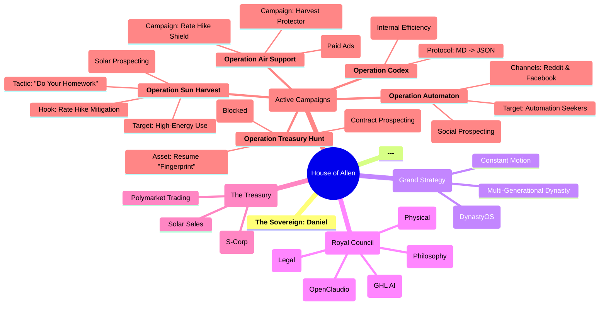

# The Empire of the House of Allen: A Strategic Mindmap

This document provides a visual overview of the entire strategic landscape of the House of Allen. You can view this by pasting the code block below into a Mermaid.js viewer, such as the one available at [mermaid.live](https://mermaid.live).

